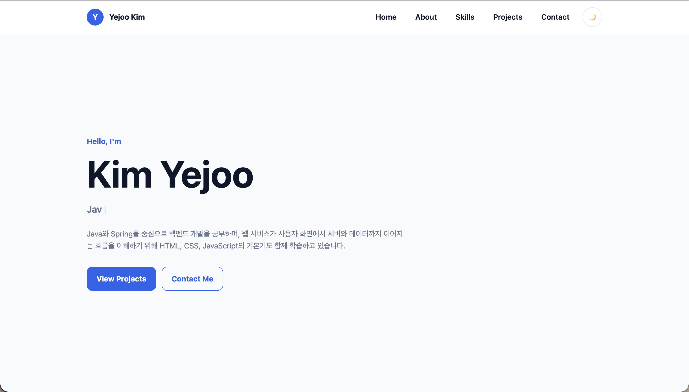
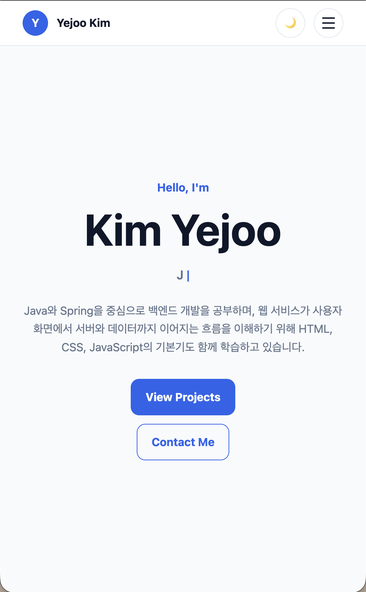
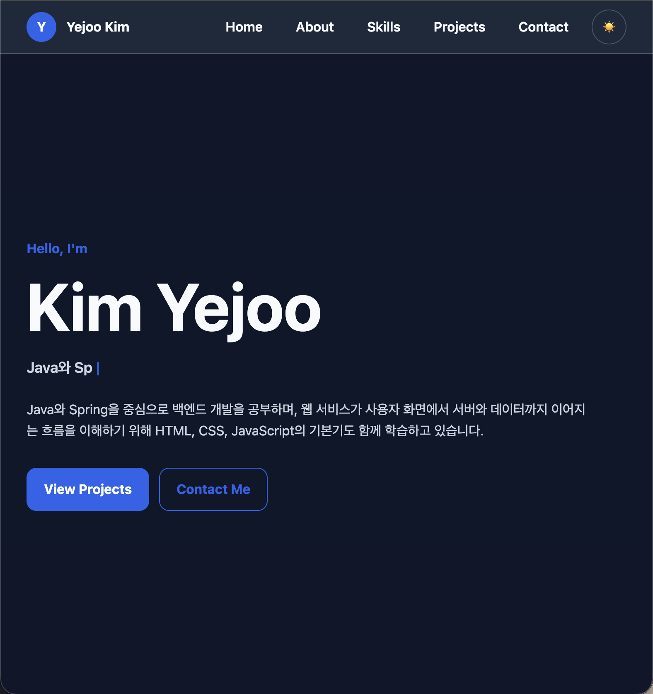
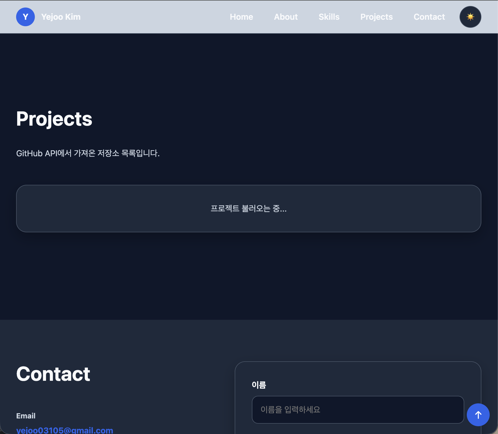
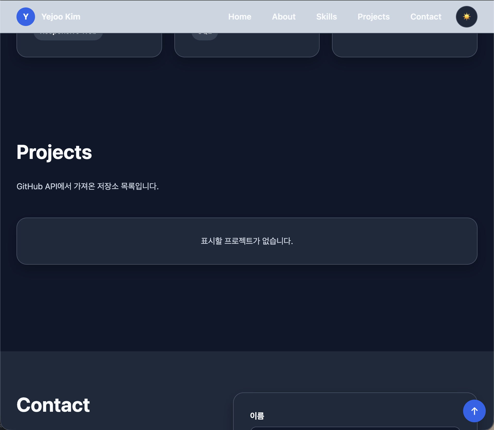
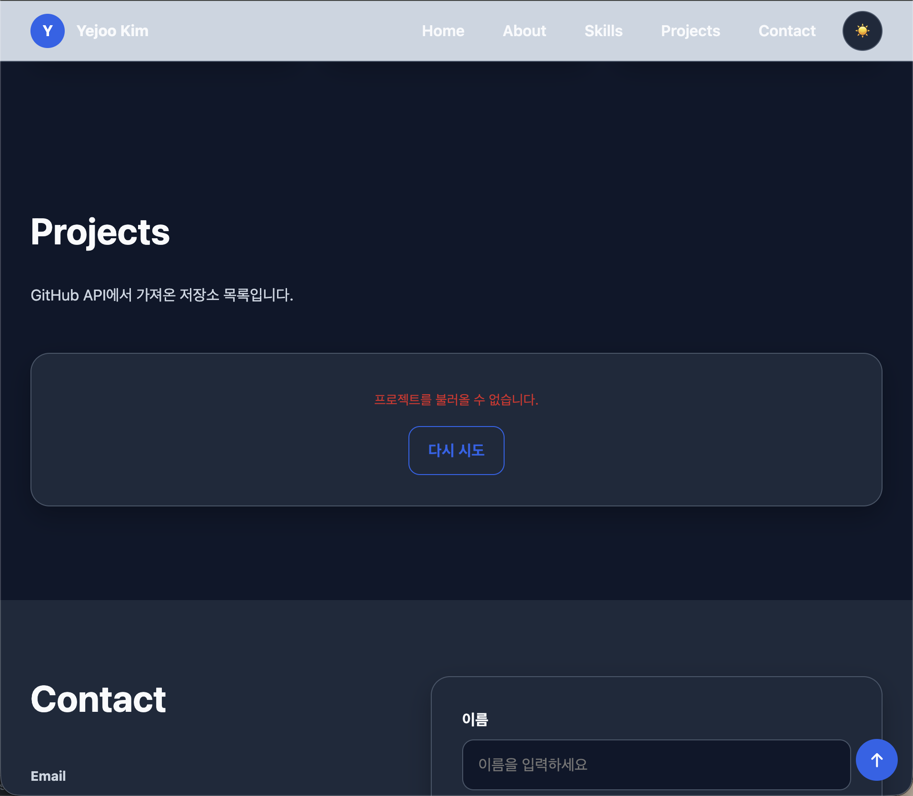
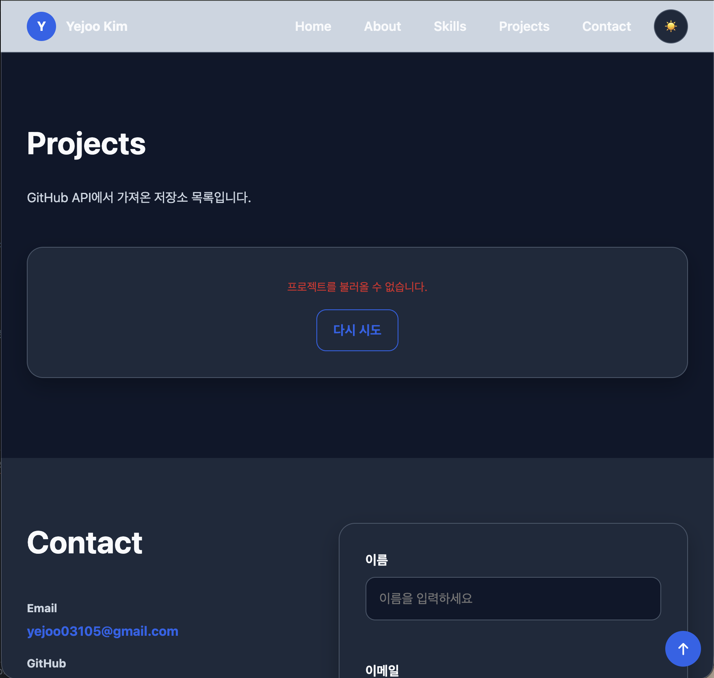
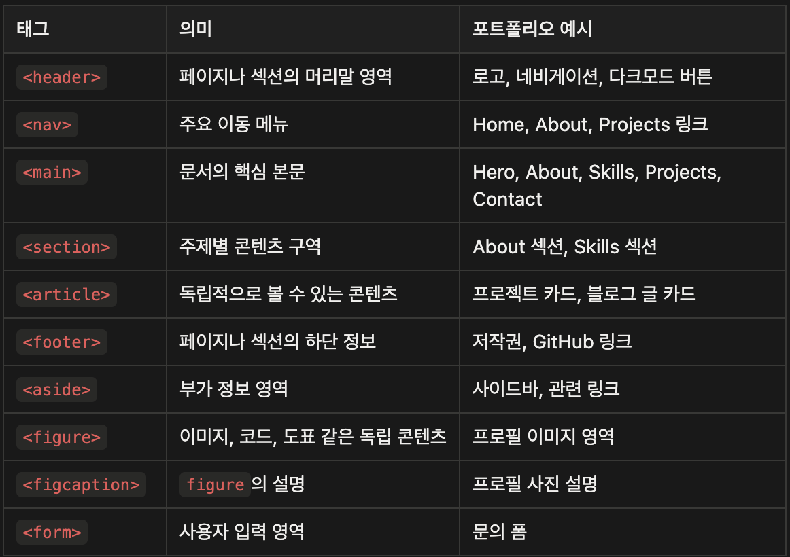

# Codyssey B4-1 | 웹 기초 완성, 나만의 포트폴리오 구축

## 1. 미션 개요
순수 HTML, CSS, JavaScript​만으로 구현한 반응형 포트폴리오 웹사이트입니다.
외부 프레임워크 없이 브라우저의 기본 기술을 사용하여 화면 구조, 스타일링, 사용자 인터랙션, 비동기 API 연동, 상태에 따른 렌더링 흐름을 직접 구현했습니다.

이 프로젝트는 단순히 정적인 화면을 만드는 것이 아니라, 사용자의 이벤트가 발생했을 때 JavaScript로 상태를 변경하고, 그 상태에 따라 DOM과 화면이 다시 바뀌는 흐름을 이해하는 것을 목표로 합니다.

## 2. 파일 구조
```
.
├── css
│   └── style.css
├── images
│   ├── profile.webp
│   ├── project-empty.png
│   ├── project-error.png
│   ├── project-limit-error.png
│   ├── project-loading.png
│   ├── screenshot-dark.png
│   ├── screenshot-desktop.png
│   ├── screenshot-mobile.png
│   └── semantic-tag.png
├── index.html
├── js
│   └── main.js
└── README.md
```

| 파일 | 역할 |
| --- | --- |
| `index.html` | 웹페이지의 전체 구조와 콘텐츠를 담당합니다. 각 섹션을 시맨틱 태그로 구성하고, 화면에 필요한 HTML 요소를 배치합니다. |
| `css/style.css` | 웹페이지의 시각적인 스타일 담당합니다. 색상, 폰트, 간격, 다크 모드, hover 효과 등 화면이 어떻게 보일지를 정의합니다. |
| `js/main.js` | 웹페이지의 동작과 사용자 인터랙션 담당합니다. 햄버거 메뉴 토글, 다크 모드 전환, 부드러운 스크롤, 스크롤 탑 버튼, 폼 유효성 검사, GitHub API 연동, 프로젝트 필터링, 타이핑 효과 등을 구현합니다. |


HTML, CSS, JavaScript는 각각 담당하는 역할이 다르기 때문에 파일을 분리했습니다.
HTML은 페이지의 구조를 담당하고, CSS는 화면의 디자인을 담당하며, JavaScript는 사용자의 행동에 따라 화면이 동적으로 바뀌는 기능을 담당합니다.

이렇게 역할을 나누면 코드의 목적이 명확해지고, 수정해야 할 위치를 쉽게 찾을 수 있습니다. 
또한 파일을 분리하면 코드가 한 파일에 섞이지 않기 때문에 유지보수가 쉬워집니다. HTML 안에 스타일이나 동작 코드를 모두 작성하면 파일이 길어지고 복잡해지지만, 역할별로 나누면 각 파일에서 무엇을 담당하는지 명확하게 파악할 수 있습니다.

이번 프로젝트에서는 외부 스타일시트와 JavaScript 파일을 HTML에 연결하여 사용했습니다. CSS 파일은 `<link>` 태그로 연결하고, JavaScript 파일은 `<script>` 태그에 defer 속성을 사용해 연결했습니다. defer를 사용하면 HTML 구조가 먼저 만들어진 뒤 JavaScript가 실행되기 때문에, JavaScript에서 DOM 요소를 안전하게 선택하고 이벤트를 연결할 수 있습니다.

## 3. 배포 URL
- GitHub Pages: https://yejoo0310.github.io/codyssey-b4-1/
- GitHub Repository: https://github.com/yejoo0310/codyssey-b4-1

## 4. 스크린샷
데스크톱 화면



모바일 화면



다크모드 화면



프로젝트 카드 로딩 중 화면



프로젝트 카드 빈 데이터 화면



프로젝트 카드 에러 화면



프로젝트 카드 리미트 에러 화면



## 5. 사용 기술
| 기술 | 역할 |
| --- | --- |
| HTML5 | 페이지의 전체 구조와 시맨틱 마크업을 구성 |
| CSS3 | 레이아웃, 반응형 디자인, 다크 모드, hover 효과 등 화면 스타일 구현 |
| JavaScript | DOM 조작, 이벤트 처리, 상태 변경, 화면 렌더링 등 인터랙션 구현 |
| GitHub API | GitHub 저장소 데이터를 가져와 Projects 섹션에 동적으로 렌더링 |
| Formspree | Contact 폼에서 입력한 메시지를 실제 이메일로 전송 |
| LocalStorage | 사용자가 선택한 다크 모드 설정을 저장하고 새로고침 후에도 유지 |
| Intersection Observer API | 요소가 화면에 보이는 시점을 감지해 스크롤 애니메이션 실행 |
| GitHub Pages | 완성된 포트폴리오 웹사이트를 외부에서 접속할 수 있도록 배포 |

## 6. 프로젝트 소개
이 포트폴리오 웹사이트는 다음 섹션으로 구성되어 있습니다.

- Hero: 인사말, CTA 버튼
- About: 자기소개, 프로필 이미지
- Skills: 기술 스택 목록
- Projects: GitHub API 연동 카드
- Contact: 문의 폼
- Footer: 저작권, GitHub 링크

이 프로젝트에서는 페이지의 전체 구조를 단순히 <div>로만 나누지 않고, HTML5 시맨틱 태그를 사용해 각 영역의 의미가 드러나도록 설계했습니다. 시맨틱 태그는 HTML 태그 자체에 의미가 담겨 있는 태그를 의미합니다.

시맨틱 태그를 사용하는 이유는 HTML 구조만 보아도 각 영역이 어떤 역할을 하는지 쉽게 이해할 수 있기 때문입니다. 



이렇게 의미 있는 태그를 사용하면 개발자가 코드를 읽을 때 구조를 더 빠르게 파악할 수 있고, 검색 엔진이나 스크린 리더 같은 도구도 페이지의 구조를 더 잘 이해할 수 있습니다. 즉, 시맨틱 태그는 단순히 코드 모양을 깔끔하게 만드는 것이 아니라, 접근성, 유지보수성, 검색 최적화 측면에서도 도움이 됩니다.

## 7. 주요 기능
### 1. 반응형 레이아웃
모바일, 태블릿, 데스크톱 화면에 맞게 레이아웃이 변경됩니다.

CSS는 모바일 퍼스트 방식으로 작성했습니다. 기본 스타일은 모바일 기준으로 작성하고, 화면이 넓어질수록 태블릿과 데스크톱 스타일을 `@media`로 추가하는 방식입니다.

이유	설명
작은 화면부터 안정적으로 대응	모바일 화면은 공간이 제한적이므로 핵심 콘텐츠를 먼저 세로 흐름으로 배치하기 좋음
점진적인 확장에 적합	화면이 넓어질수록 필요한 레이아웃만 추가하면 됨

모바일 퍼스트로 작성한 이유는 작은 화면부터 안정적으로 대응하기 위해서입니다. 모바일 화면은 공간이 제한적이므로 핵심 콘텐츠를 먼저 세로 흐름으로 배치하기 좋습니다. 이후 화면이 넓어지면 숨겨져 있던 메뉴를 가로로 보여주고, 카드나 섹션 레이아웃을 여러 열로 확장하면 됩니다.

이 방식은 작은 화면에서 필요한 핵심 스타일을 먼저 만들고, 넓은 화면에서는 필요한 스타일만 추가하면 되기 때문에 코드 흐름이 자연스럽습니다. 반대로 데스크톱 기준으로 먼저 만들고 모바일 스타일을 나중에 줄이면, 넓은 화면에서 만든 복잡한 레이아웃을 다시 단순하게 되돌려야 해서 코드가 더 복잡해질 수 있습니다.

이번 프로젝트에서는 기본 스타일을 모바일 기준으로 작성했습니다. 예를 들어 모바일에서는 네비게이션 메뉴가 숨겨지고 햄버거 버튼이 보이며, Hero 버튼과 Footer 내용은 세로 방향으로 배치됩니다. 이후 `768px` 이상에서는 네비게이션 메뉴를 항상 보이게 하고 햄버거 버튼을 숨기며, About, Skills, Contact 같은 섹션의 레이아웃을 더 넓은 화면에 맞게 확장했습니다.

또한 `1024px` 이상에서는 헤더 높이, 섹션 여백, Hero 제목 크기, 프로젝트 카드 최소 너비 등을 조정하여 데스크톱 화면에서 더 여유 있게 보이도록 했습니다.

### 2. 햄버거 메뉴
모바일 화면에서는 네비게이션 메뉴가 사라지고 햄버거 버튼이 표시됩니다.
햄버거 버튼을 클릭하면 `active` 클래스가 토글되어 메뉴가 나타나거나 사라집니다. 

또한 메뉴의 열림 상태를 접근성 속성인 `aria-expanded`와 `aria-label`에 반영했습니다.

모바일에서 네비게이션 링크를 클릭하면 `closeMobileMenu()` 함수가 실행되어 메뉴가 자동으로 닫힙니다.

### 3. 다크 모드
다크 모드 토글 버튼을 클릭하면 `<html>` 요소의 `data-theme` 값이 `light` 또는 `dark`로 변경됩니다.

CSS에서는 다크 모드용 CSS 변수를 따로 정의했습니다.

JavaScript에서는 사용자가 선택한 테마를 `localStorage`에 저장합니다. 그래서 새로고침 후에도 사용자가 선택한 테마가 유지됩니다.

또한 저장된 테마가 없을 경우 `prefers-color-scheme`을 사용해 사용자의 시스템 다크 모드 설정을 감지합니다.

### 4. 스크롤 탑 버튼
페이지를 일정 거리 이상 스크롤하면 오른쪽 아래에 맨 위로 이동하는 버튼이 표시됩니다.

현재 기준값은 다음과 같습니다.
```
const SCROLL_TOP_VISIBLE_OFFSET = 300;
```
즉, 사용자가 `300px` 이상 스크롤하면 스크롤 탑 버튼이 나타납니다.
버튼을 클릭하면 `window.scrollTo()`를 사용해 페이지 최상단으로 부드럽게 이동합니다.

### 5. 스크롤 시 헤더 스타일 변경
사용자가 페이지를 아래로 스크롤하면 헤더에 `scrolled` 클래스가 추가되어 헤더 스타일이 변경됩니다.

현재 기준값은 다음과 같습니다.
```
const HEADER_SCROLLED_OFFSET = 60;
```
즉, `60px` 이상 스크롤하면 헤더 스타일이 변경됩니다. CSS에서는 `.site-header.scrolled `선택자를 사용해 스크롤 후 헤더 배경색을 다르게 적용했습니다.

### 6. 부드러운 스크롤
네비게이션 링크를 클릭하면 기본 앵커 이동을 `event.preventDefault()`로 막고, JavaScript의 `scrollIntoView()`를 사용해 해당 섹션으로 부드럽게 이동하도록 구현했습니다.

이 기능은 사용자가 메뉴를 클릭했을 때 갑자기 이동하는 대신 자연스럽게 해당 섹션으로 이동하게 해 줍니다.

### 7. 스크롤 애니메이션
About, Skills, Projects, Contact 등 일부 요소에는 `.reveal` 클래스를 적용했습니다.
처음에는 요소가 아래로 살짝 내려가고 투명한 상태였다가, 화면에 일정 비율 이상 보이면 `.show `클래스가 추가되어 자연스럽게 나타납니다.

`Intersection Observer`의 기준값은 다음과 같습니다.
```
threshold: 0.2
```
즉, 요소가 화면에 20% 이상 보이면 애니메이션이 실행됩니다.

### 8. Contact 폼 유효성 검사 및 실제 전송
Contact 섹션에는 이름, 이메일, 메시지를 입력하는 문의 폼이 있습니다.

폼에서는 다음 유효성 검사를 수행합니다.

- 이름 필수 입력 검사
- 이메일 필수 입력 검사
- 이메일 형식 검사
- 메시지 필수 입력 검사

검증에 실패하면 각 입력 필드 근처에 에러 메시지가 표시됩니다.
입력값이 올바르면 `Formspree`로 실제 메시지를 전송합니다.

HTML의 form에는 Formspree 주소가 `action`으로 연결되어 있고, JavaScript에서는 `fetch()`와 `FormData`를 사용해 비동기로 폼 데이터를 전송합니다.

### 9. GitHub API 연동
Projects 섹션에서는 GitHub API를 호출하여 저장소 목록을 동적으로 렌더링합니다.

사용한 API 엔드포인트는 다음과 같습니다.
```
https://api.github.com/users/yejoo0310/repos
```

JavaScript에서는 `fetch`와 `async/await`를 사용해 데이터를 가져오고, `try/catch`로 에러를 처리합니다.

구현된 상태 UI는 다음과 같습니다.

| 상태 | 화면 표시 |
| --- | --- |
| 로딩 | `프로젝트 불러오는 중...` |
| 성공 | GitHub 저장소 카드 목록 |
| 에러 | `프로젝트를 불러올 수 없습니다.` 메시지와 `다시 시도` 버튼 |
| 빈 데이터 | `표시할 프로젝트가 없습니다.` |

저장소 데이터는 `map()`을 사용해 HTML 카드 문자열로 변환한 뒤 Projects 영역에 렌더링합니다. 저장소 이름, 설명, 사용 언어, Star 수, Fork 수, GitHub 링크가 카드에 표시됩니다.

### 10. 프로젝트 언어 필터링
GitHub API로 가져온 저장소 목록에서 각 저장소의 `language` 값을 추출해 필터 버튼을 생성했습니다.

- `All`: 전체 프로젝트 표시
- 각 언어 버튼: 해당 언어의 프로젝트만 표시

필터 버튼을 클릭하면 `selectedLanguage` 상태가 변경되고, `filter()`를 사용해 해당 언어와 일치하는 저장소만 다시 렌더링합니다.

### 11. Hero 타이핑 효과
Hero 섹션의 소개 문구에는 타이핑 효과를 구현했습니다.
문자열을 한 글자씩 보여준 뒤, 다시 한 글자씩 지우고 반복하는 방식입니다.

현재 속도 설정은 다음과 같습니다.

```
const typingSpeed = 80;
const deletingSpeed = 80;
const pauseAfterTyping = 1200;
const pauseAfterDeleting = 500;
```

## 8. CSS 설계
CSS는 다음 기준으로 작성했습니다.

### 1. CSS 변수 사용
`:root`에 색상, 폰트, 간격, 크기, radius, shadow, transition 값을 변수로 정의했습니다.

이렇게 작성하면 색상이나 간격을 한 곳에서 관리할 수 있고, 다크 모드 전환도 CSS 변수 값만 바꾸는 방식으로 쉽게 처리할 수 있습니다.

### 2. Flexbox와 Grid
CSS에서 Flexbox와 Grid는 모두 레이아웃을 만들 때 사용하는 도구입니다.
둘 다 요소를 정렬하고 배치할 수 있지만, 목적이 조금 다릅니다.

#### 1. Flexbox란?

Flexbox는 요소들을 한 방향으로 정렬할 때 사용하기 좋은 레이아웃 방식입니다.

주로 가로 방향 또는 세로 방향 중 하나를 기준으로 요소를 배치합니다.

예를 들어 로고와 메뉴를 한 줄에 배치하거나, 버튼들을 가로 또는 세로로 정렬하거나, 카드 안의 텍스트와 링크를 위아래로 정렬할 때 적합합니다.

Flexbox를 사용하면 자식 요소들을 한 줄에 놓고, 세로 가운데 정렬하거나 양쪽 끝으로 배치하는 작업을 쉽게 할 수 있습니다.

#### 2. Grid란?

Grid는 요소들을 행과 열을 가진 2차원 레이아웃으로 배치할 때 사용하기 좋은 방식입니다.

Flexbox가 한 방향 정렬에 강하다면, Grid는 여러 개의 칸을 만들고 그 안에 요소를 배치하는 데 강합니다.

예를 들어 프로젝트 카드 목록처럼 화면 크기에 따라 1열, 2열, 3열로 바뀌는 레이아웃에는 Grid가 적합합니다.

#### 3. Flexbox와 Grid의 차이

| 구분 | Flexbox | Grid |
| --- | --- | --- |
| 기준 방향 | 한 방향 중심 | 행과 열, 두 방향 중심 |
| 적합한 상황 | 가로 정렬 또는 세로 정렬 | 카드 목록, 섹션 배치, 전체 레이아웃 |
| 레이아웃 방식 | 콘텐츠 흐름에 따라 유연하게 정렬 | 칸을 먼저 만들고 그 안에 요소 배치 |
| 대표 사용 예시 | 네비게이션, 버튼 그룹, 카드 내부 정렬 | 프로젝트 카드 목록, 기술 카드 목록, About 섹션 배치 |
| 핵심 목적 | 줄 안에서 정렬하기 | 영역을 나누고 배치하기 |

쉽게 말하면, 한 줄이나 한 방향으로 정렬하면 Flexbox, 여러 칸으로 나누어 배치하면 Grid를 선택했습니다.

#### 4. 이 프로젝트에서 Flexbox를 사용한 곳

#### 1. Header / Navigation

```css
.navbar {
  display: flex;
  align-items: center;
  justify-content: space-between;
}
```

Header에서는 왼쪽에 로고, 오른쪽에 메뉴와 버튼들을 배치해야 했습니다.
이 구조는 한 줄 안에서 좌우로 정렬하는 레이아웃이기 때문에 Flexbox를 사용했습니다.

이 상황에서 Grid를 사용하지 않은 이유는 행과 열을 복잡하게 나눌 필요가 없었기 때문입니다.
Header는 단순히 한 줄에서 왼쪽과 오른쪽을 나누는 구조이므로 Flexbox가 더 적합했습니다.

#### 2. Navigation Actions

```css
.nav-actions {
  display: flex;
  align-items: center;
  gap: var(--space-sm);
}
```

`nav-actions` 안에는 네비게이션 메뉴, 다크 모드 버튼, 햄버거 버튼이 들어갑니다.
이 요소들은 한 줄로 나란히 정렬되면 되기 때문에 Flexbox를 사용했습니다.

#### 3. Hero 버튼 영역

```css
.hero-actions {
  display: flex;
  flex-direction: column;
  gap: var(--space-sm);
  align-items: center;
}
```

모바일에서는 Hero 영역의 버튼들을 세로로 배치했습니다.

그리고 태블릿 이상에서는 방향을 가로로 변경했습니다.

```css
@media (min-width: 768px) {
  .hero-actions {
    flex-direction: row;
    justify-content: flex-start;
  }
}
```

버튼들은 한 방향으로만 정렬하면 되기 때문에 Grid보다 Flexbox가 적합했습니다.

#### 4. Skill 목록

```css
.skill-list {
  display: flex;
  flex-wrap: wrap;
  gap: var(--space-xs);
}
```

각 기술 이름들은 작은 태그처럼 나열됩니다.

화면이 좁으면 다음 줄로 자연스럽게 넘어가야 하므로 `flex-wrap`을 사용했습니다.
이 경우에도 정확한 행과 열의 칸을 만들기보다는 콘텐츠가 흐르듯이 배치되면 되기 때문에 Flexbox가 적합했습니다.

#### 5. Project 카드 내부

```css
.project-card {
  display: flex;
  flex-direction: column;
}
```

프로젝트 카드 안에서는 제목, 설명, 메타 정보, 링크가 위에서 아래로 쌓입니다.

이 구조는 카드 내부 요소를 세로 방향으로 정렬하는 것이기 때문에 Flexbox를 사용했습니다.

#### 6. Footer

```css
.footer-content {
  display: flex;
  flex-direction: column;
  align-items: center;
}
```

모바일에서는 Footer 내용을 세로로 배치하고, 태블릿 이상에서는 가로로 배치했습니다.

```css
@media (min-width: 768px) {
  .footer-content {
    flex-direction: row;
    text-align: left;
  }
}
```

Footer 역시 단순히 저작권 문구와 링크를 한 방향으로 정렬하는 구조이므로 Flexbox를 사용했습니다.

#### 5. 이 프로젝트에서 Grid를 사용한 곳

#### 1. About 섹션

```css
.about-content {
  display: grid;
  gap: var(--space-xl);
}
```

모바일에서는 프로필 이미지와 소개 글이 세로로 배치됩니다.

태블릿 이상에서는 다음처럼 이미지와 텍스트가 두 칸으로 나뉩니다.

```css
@media (min-width: 768px) {
  .about-content {
    grid-template-columns: 260px 1fr;
    align-items: center;
  }
}
```

이 경우에는 왼쪽 칸은 이미지 영역, 오른쪽 칸은 텍스트 영역으로 명확하게 나뉘기 때문에 Grid가 적합했습니다.

#### 2. Skills 카드 목록

```css
.skill-grid {
  display: grid;
  gap: var(--space-lg);
}
```

모바일에서는 기술 카드가 세로로 쌓입니다.

태블릿 이상에서는 3개의 카드를 한 줄에 배치했습니다.

```css
@media (min-width: 768px) {
  .skill-grid {
    grid-template-columns: repeat(3, 1fr);
  }
}
```

기술 카드는 같은 성격의 카드들이 일정한 열 구조로 배치되는 영역이기 때문에 Grid를 선택했습니다.

#### 3. Projects 카드 목록

```css
.project-grid {
  display: grid;
  gap: var(--space-lg);
  grid-template-columns: repeat(auto-fit, minmax(260px, 1fr));
}
```

Projects 영역은 GitHub API에서 가져온 저장소 카드들을 보여주는 곳입니다.

카드 개수가 API 데이터에 따라 달라질 수 있고, 화면 너비에 따라 1열, 2열, 3열 이상으로 자연스럽게 바뀌어야 하기 때문에 Grid가 가장 적합했습니다.

`auto-fit`과 `minmax()`를 사용했기 때문에 카드 개수와 화면 너비에 따라 브라우저가 자동으로 열 개수를 조정합니다.

#### 4. Contact 섹션

```css
.contact .container {
  display: grid;
  gap: var(--space-xl);
}
```

모바일에서는 연락처 정보와 폼이 세로로 배치됩니다.


태블릿 이상에서는 두 영역을 좌우로 나누었습니다.

```css 
@media (min-width: 768px) {
  .contact .container {
    grid-template-columns: 0.9fr 1.1fr;
    align-items: start;
  }
}
```

Contact 섹션은 단순한 한 줄 정렬이 아니라, 페이지 안에서 정보 영역과 입력 폼 영역을 두 개의 큰 칸으로 나누는 구조입니다.
그래서 Flexbox보다 Grid가 더 적합했습니다.

#### 6. 실제 코드 기준 선택 이유 정리

| 영역                | 사용한 방식  | 선택한 이유                                     |
| ----------------- | ------- | ------------------------------------------ |
| Header / Navbar   | Flexbox | 로고와 메뉴를 한 줄에서 좌우로 정렬하기 위해                  |
| Nav Actions       | Flexbox | 메뉴, 다크 모드 버튼, 햄버거 버튼을 가로로 나란히 배치하기 위해      |
| Hero 버튼           | Flexbox | 모바일에서는 세로, 태블릿 이상에서는 가로로 방향만 바꾸면 되기 때문에    |
| Skill List        | Flexbox | 기술 태그들을 한 방향으로 나열하고 줄바꿈 처리하기 위해            |
| Project Card 내부   | Flexbox | 카드 내부 요소를 세로로 쌓고 링크를 아래쪽에 배치하기 위해          |
| Footer            | Flexbox | 저작권 문구와 링크를 모바일/데스크톱에 따라 세로 또는 가로로 정렬하기 위해 |
| About Content     | Grid    | 프로필 이미지와 소개 글을 두 영역으로 나누기 위해               |
| Skill Grid        | Grid    | 여러 기술 카드를 동일한 열 구조로 배치하기 위해                |
| Project Grid      | Grid    | GitHub 프로젝트 카드를 반응형 카드 레이아웃으로 배치하기 위해      |
| Contact Container | Grid    | 연락처 정보와 문의 폼을 두 개의 큰 영역으로 나누기 위해           |

#### 7. 정리

이 프로젝트에서는 단순히 가로 또는 세로 방향으로 요소를 정렬해야 하는 곳에는 Flexbox를 사용했습니다.
반대로 여러 개의 카드나 큰 콘텐츠 영역을 행과 열로 나누어 배치해야 하는 곳에는 Grid를 사용했습니다.

즉, 선택 기준은 다음과 같습니다.

```text id="sdfm7f"
한 방향 정렬이 중심이면 Flexbox
영역을 나누거나 카드 목록을 배치하면 Grid
```

이 기준에 따라 Header, 버튼 그룹, Footer, 카드 내부 정렬에는 Flexbox를 사용했고, About, Skills 카드 목록, Projects 카드 목록, Contact 섹션처럼 화면을 큰 영역이나 여러 열로 나누는 곳에는 Grid를 사용했습니다.

## 9. JavaScript 설계
### 1. onclick 인라인 속성 대신 addEventListener 사용
`addEventListener` 는 어떤 DOM 요소의 이벤트를 감지하고, 이벤트가 발생했을 때 실행할 동작을 연결하는 메서드이다.

```jsx
요소.addEventListener("이벤트이름", 실행할함수);
```

웹에서 이벤트는 사용자나 브라우저에서 발생하는 행동이라고 보면 된다.

`onclick` 은 이벤트를 연결하는 또 다른 방식이다. 

HTML에 직접 쓸 수도 있고, 

```html
<button onclick="openMenu()">메뉴</button>
```

JS에서 속성처럼 넣을 수도 있다.

```jsx
button.onclick = () => {
	console.log("클릭됨");
};
```

**둘의 차이점**

(1) `onclick` 은 같은 이벤트에 하나만 연결된다.
    
```jsx
button.onclick = () => {
console.log("첫 번째");
};

button.onclick = () => {
console.log("두 번째");
};
```

이렇게 하면 두 번째 코드가 첫 번째 코드를 덮어써서 두 번째만 실행된다.

왜냐하면 `onclick` 은 요소의 `onclick` 속성에 함수를 넣는 방식이기 때문이다.
    
(2) `addEventListener` 는 같은 이벤트에 여러 함수를 등록할 수 있다.

```jsx
button.addEventListener("click", () => {
  console.log("첫 번째");
});

button.addEventListener("click", () => {
  console.log("두 번째");
});
```

이 경우 둘 다 실행된다.

`onclick` 이 이벤트 속성에 대입하는 느낌이라면, `addEventListener` 는 이벤트를 추가 등록하는 느낌이다.
    
**addEventListener 사용을 더 선호하는 이유**

(1) HTML과 JS를 분리할 수 있다.
    
HTML은 구조를 담당하고, JS는 동작을 담당하는 구조가 좋다.

`onclick` 을 사용하면 HTML 안에 JS 동작이 섞이게 된다.
    
(2) 같은 이벤트에 여러 동작을 안전하게 연결할 수 있다.
